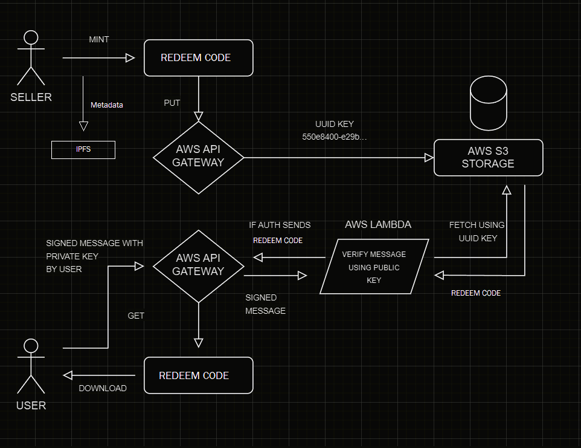

# Scratch Marketplace

Welcome to Scratch Marketplace, your gateway to a decentralized marketplace for buying and selling coupon cards and vouchers as NFTs! Empowering users with the freedom to transact securely and seamlessly, Scratch is an application designed to redefine your E-voucher experience.

Scratch uses AWS Lambda and API Gateway to ensure privacy and security. These technologies work together to verify user-signed messages, guaranteeing that only authorized users can access NFT data. Here is a detailed diagram of the security mechanics.

| Network | Address                                                                                                                            |
| ------- | ---------------------------------------------------------------------------------------------------------------------------------- |
| Testnet | [`0x8036156dB4Cf9D561e459B83c0b8Fc884482A9C4 `](https://evm-sidechain.xrpl.org/address/0x8036156dB4Cf9D561e459B83c0b8Fc884482A9C4) |



When the user mints a Coupon (or) Voucher as an NFT, The secret Redeem Code entered by the creator is stored in Amazon S3 storage using API Gateway. Each file is given a unique UUID for its identification. Then the metadata of the NFT is uploaded to IPFS using Pinata this will contain the NFT description with the UUID of the Secret Redeem Code file. Now when a user tries to fetch the Secret Redeem Code file through API Gateway a Lambda function verifies the user through user-signed messages and will return the Secret code only if the user is the owner of the NFT. This makes it impossible for anyone but the owner to access the Secret code, hence assuring the most robust security.

### Projects Structure

- `Backend/`: Smart contract

  - `Sratch.sol`: Contains the Solidity contract code
  - Deployed to the XRPL EVM Sidechain testnet using hardhat and ethers.js

- `Frontend/`: Web application code

  - Next.js framework was used to build the application
  - Tailwind css was used for styling the elements
  - Ethers.js and Moralis were used for integration

- `Lambda/`: AWS Lambda code

  - `index.js`: Contains the backend code used for verifying signed messages from users
  - `contracts/`: This has the smart contract information
  - When authenticated using ethers.js, it retreives the file from S3 storage

## Getting Started

### Production Build

The easiest way to try Scratch Marketplace is by accessing the deployed production build

- [`Scratch Marketplace`](https://scratch-marketplace.vercel.app/) <- Link to site
- Connect your prefered wallet (eg. MetaMask) and make sure you have some XRPL test XRP
- [`XRP Faucet`](https://xrpl.org/xrp-testnet-faucet.html) <- visit to get test XRP
- That's it! now you can access all the features of our project

### Localhost

1. Clone this repository

   ```sh
   git clone https://github.com/nikhilkxmar/Scratch-Marketplace.git
   ```

2. Install NPM packages
   ```sh
   npm install
   ```
3. Copy the `.env.example` file to `.env` and fill in your environment variables
   ```sh
   cp .env.example .env
   ```
4. Start the development server

   ```sh
   cd frontend
   ```

   ```sh
   npm run dev
   ```

5. Open [http://localhost:3000](http://localhost:3000) with your browser to see the result
